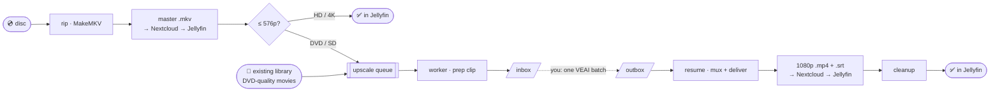

# rip-movie

**Insert a disc, walk away.** `rip-movie` takes a physical DVD/Blu-ray from the tray to Jellyfin
with no babysitting: it rips the disc, delivers a lossless master to Nextcloud so Jellyfin picks it
up immediately, and — for standard-def discs — queues an AI upscale that lands a 1080p, Apple
direct-play rendition beside it. It can also **upgrade the DVDs already in your library**: point it
at your Movies folder, and it re-upscales every SD title in place.



Ripping is disc-bound (~20 min); the AI upscale runs through **Topaz Video Enhance AI** as a
**semi-automated handoff** (one GUI batch you kick off, everything else automatic). The two are
**decoupled by a queue**: a disc rips and delivers its master fast, then its upscale waits its turn.

## Watch it live

`rip-movie dashboard` serves a live view at `http://localhost:8422`:

- **Pipeline board** — one swimlane per movie through Rip → Master → Nextcloud → Upscale → Cleanup →
  In Jellyfin. Lane colors: **amber** = the pipeline is working on it, **blue slow-flash** = a clip
  is prepped in your inbox and waiting on you to run Topaz, **green** = in Jellyfin.
- **📼 upgrade DVDs** (`/library`) — every movie already in your library, classified by quality.
  DVD-quality titles get a one-click **Queue upscale** button (or Queue all).
- **⚙ config** (`/config`) — edit `rip-movie.toml` from the browser and run a health check.
- A **library search** over movies + TV, and a **recent-pushes** feed.


## The environment this is built for

| Piece | Detail |
|---|---|
| Rip station | Mac (Apple silicon) + USB ASUS BW-16D1HT BD/DVD drive |
| Tools | `makemkvcon`, `ffmpeg`, `tesseract` + `mkvtoolnix` (subtitle OCR), `kubectl` |
| Upscaler | **Topaz Video Enhance AI 2.6.4** (GUI, watermark-free on an owned license), model **Proteus** |
| Library store | Nextcloud user **HomeMedia** → `Videos/Movies/` and `Videos/TV_Shows/` on CephFS |
| Player | Jellyfin on a **4× Raspberry Pi 5 (k3s)** cluster — **no hardware encoder, never transcodes** |
| Clients | Apple TV, iPhone, iPad only — **no DTS decode**, so everything must **direct-play** |

Because the Pi 5 cluster can't transcode, every watchable file must direct-play on Apple devices.
That single constraint drives every encoding decision below.

## Two-tier output: lossless master + Apple rendition

Every movie gets **two files in the same folder**, matching the library's existing pattern:

1. **Master** — a lossless, untouched stream-copy of the disc (`.mkv`). All audio tracks in their
   original codec (DTS/TrueHD included), original bitmap subtitles, nothing re-encoded. This is the
   *rip-once* keeper: the physical disc is never needed again, and better renditions can be
   re-derived from it as upscalers improve.
2. **Rendition** — the watchable copy, generated when the source needs it:

   | Master | Rendition |
   |---|---|
   | **DVD / MPEG-2 (≤576p)** | **AI upscale → 1080p H.264** `.mp4` + OCR'd English `.srt` |
   | H.264 / HEVC 1080p or 4K | none — the master already direct-plays |

   HD/4K sources are **not upscaled** — they're already full resolution — so they ship as the ripped
   master.

### Naming schema (reverse-engineered from the existing library)

```
Movies/{Title} ({Year})/{Title} ({Year}) - {resTag} {codecTag}.{ext}
  e.g.  Armageddon (1998)/Armageddon (1998) - 480p MPEG.mkv     ← master
        Armageddon (1998)/Armageddon (1998) - 1080p AVC.mp4     ← rendition
        Armageddon (1998)/Armageddon (1998) - 1080p AVC.eng.srt ← OCR'd subtitles
```
`resTag` → `480p`/`720p`/`1080p`/`2160p` (width-aware, so a 1920×828 scope film is `1080p`, not
`720p`) · `codecTag` → `AVC`/`HEVC`/`MPEG`/`Microsoft` (VC-1).

## The upscale — a Topaz handoff

DVD upscaling runs through a **pluggable engine** (`upscale.engine`):

- **`topaz-veai-handoff`** (default, best quality) — Topaz Video Enhance AI 2.6.4. It's GUI-only (no
  CLI) and watermark-free on an owned license, so the pipeline can't drive it headlessly. Instead it
  **splits the upscale around one manual step** and automates everything else.
- **`realesrgan`** — Real-ESRGAN compiled to CoreML on the Neural Engine. Fully automated (no manual
  step), but its halo/wash-out tradeoffs are why we landed on Topaz.

### How the handoff works

```
prep    source → IVTC/decimate + autocrop + un-anamorph → a VIDEO-ONLY clip in ~/rip-movie/topaz/inbox/
        (correctly stamped 23.976, tagged [Proteus] for live action / [Proteus no-grain] for animation)
you     open Video Enhance AI, drag in every inbox clip, run your saved Proteus preset (output 1920-wide
        → ~/rip-movie/topaz/outbox/), and walk away — VEAI processes the batch back-to-back
resume  when a COMPLETE, full-length render appears in the outbox, the pipeline crops off any letterbox
        VEAI re-added, locks a clean 23.976 CFR, muxes the master's original audio (Apple-ified) + OCR'd
        subs, delivers the 1080p rendition, and cleans up
```

Audio and subtitles **never go through Topaz** — only video round-trips, so A/V sync is guaranteed
as long as the frame count is preserved. Two things the prep gets right that otherwise cause grief:

- **Frame rate.** DVD film is 23.976 progressive but the container is flagged 29.97 (soft telecine).
  VEAI trusts that flag and duplicates ~1-in-5 frames to "fill" 29.97 → periodic judder. The prep
  **decodes the true rate and stamps the clip 23.976 CFR**, so VEAI never duplicates.
- **Geometry.** A 2.35 scope film letterboxed on a 4:3 DVD is de-barred and un-anamorphed before
  Topaz (so it upscales the *real* picture), and VEAI's re-added 16:9 padding is auto-cropped after.

**Model:** Proteus (Fine Tune) for everything — the only difference is **Grain: ON for live action**
(fights the plastic look), **OFF for animation** (cel/CGI is clean; grain looks wrong). Save two
VEAI presets; each inbox clip's `[tag]` says which to run.

**Audio (rendition):** every source track kept — Apple-native codecs (AC3/AAC/E-AC3) copied as-is,
DTS/TrueHD transcoded to AC3 5.1, plus one AAC stereo default. The *original* DTS stays in the
master. **Subtitles:** English only — an existing text track is used directly, otherwise the DVD's
bitmap VobSub is OCR'd to a sidecar `.srt` with tesseract (~98% accurate).

## Upgrade your existing DVD library

Open **📼 upgrade DVDs** on the dashboard. It scans your Movies folder, classifies every title
(DVD-quality / already-upscaled / HD), and lets you **queue any ≤576p movie that has no HD copy**.
When the worker picks one up it **pulls the master back from Nextcloud**, preps it to the inbox, and
— after your VEAI batch — delivers the 1080p rendition beside the DVD master. So a whole backlog
becomes: tick the movies → let the worker prep them → one overnight VEAI batch → they upgrade
themselves.

## Title selection — the "black art"

Commercial discs expose many titles; picking wrong wastes hours. The heuristic, strongest signal
first:

- **TMDb runtime match** — pick the title whose duration is closest to the movie's known runtime.
  This cuts straight through decoy playlists and episodic discs.
- **Duplicate collapse** — identical duration + chapter count = the same feature listed twice.
- **Ambiguity guard** — otherwise, if several titles are near-equal length, the disc goes to a
  **review queue** rather than guessing.

DVD volume labels are often unusable (`ARMAGEDN`, `COURAGEUNDERFIREDTSVER3`). When auto-identify
can't recover one, pass `--name "Armageddon" --year 1998` and the runtime match handles the rest.

## Commands

```bash
rip-movie config-check                  # validate config, tools, cluster reachability
rip-movie dashboard                     # live dashboard + upgrade-DVDs viewer at http://localhost:8422
rip-movie search wall-e                 # is it in the library? (movies + TV, no disc needed)

rip-movie watch                         # daemon: rip each inserted disc → deliver master → queue → eject
rip-movie disc [--name … --year …]      # process the disc in the drive once (identify → rip → master → queue)
rip-movie upscale-worker                # daemon: drain the upscale queue (Topaz handoff or Real-ESRGAN)
rip-movie queue                         # list pending / awaiting-Topaz / failed upscale jobs
rip-movie status                        # drive, running rip/upscale, queue depth

rip-movie rip [--title N]               # just rip the disc to an mkv (auto-selects the main title)
rip-movie run FILE --title "…"          # a ripped file, end-to-end (Real-ESRGAN engine, inline)
rip-movie push FILE --title "…"         # name to schema + deliver to Nextcloud + refresh Jellyfin
rip-movie review                        # resolve ambiguous discs queued for a manual title pick
```

The **walk-away setup** is two daemons: `watch` rips discs and queues their upscales; `upscale-worker`
drains the queue. With the Topaz engine, the worker preps clips to your inbox and finishes each one
when its render lands in the outbox — so your only manual step is one VEAI batch.

## Delivery & cleanup

Files stream into the Nextcloud pod over `kubectl` to a `.part` and atomically rename (a partial
transfer never gets indexed), get `chown`'d to the web user, then `occ files:scan` registers just
that folder and Jellyfin is refreshed + force-identified to the right TMDb id. A **duration
safety-net** refuses to deliver any rendition whose length doesn't match its source (so a partial or
aborted upscale can never land in the library). Local temporaries are removed **only after** delivery
is confirmed — so a failed run can always be retried.

## Configuration

Everything lives in `config/rip-movie.toml`; secrets (TMDb key, Jellyfin API key) come from
`config/secrets.env` (gitignored) via `${ENV_VAR}` expansion. Key knobs: `upscale.engine`
(`topaz-veai-handoff`/`realesrgan`), `upscale.mode` (`queue`/`inline`), the `[upscale.topaz_handoff]`
table (inbox/outbox, `output_fps`, per-genre Proteus tags), `upscale.dvd.autocrop`,
`upscale.dvd.sd_max_height`, `encode.audio.languages`, `deliver.keep_source_master`.

## Status

Full pipeline, disc-to-Jellyfin, validated on real discs. Topaz VEAI handoff (prep → VEAI → resume)
with the soft-telecine frame-rate fix, VEAI-letterbox auto-crop, and complete-render guard; the
decoupled queue + worker with on-demand Nextcloud pull for re-upscaling existing library titles; the
live swimlane dashboard + upgrade-DVDs viewer; two-tier delivery to the correct Nextcloud path +
Jellyfin index; VobSub→SRT OCR. See `AGENTS.md` for the architecture and developer notes.
