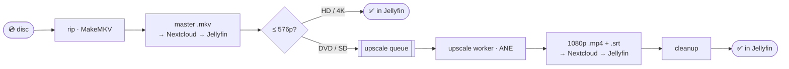
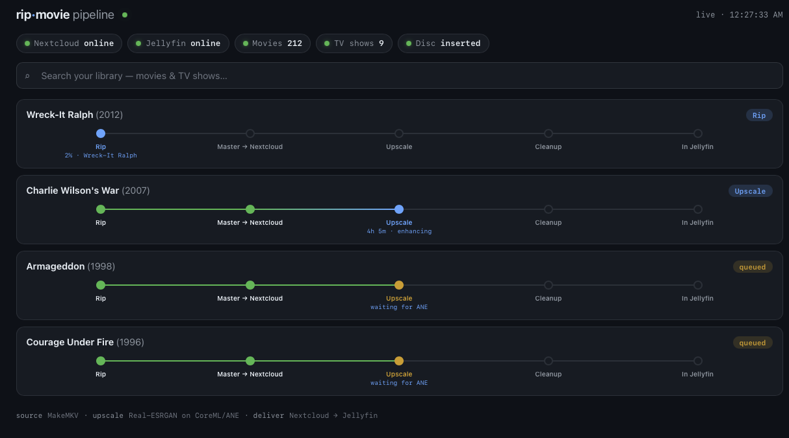

# rip-movie

**Insert a disc, walk away.** `rip-movie` takes a physical DVD/Blu-ray from the tray to Jellyfin
with no babysitting: it rips the disc, delivers a lossless master to Nextcloud so Jellyfin picks it
up immediately, and — for standard-def discs — queues an AI upscale that lands a 1080p, Apple
direct-play rendition beside it. Feed in a stack of discs; they rip back-to-back while the upscales
churn through a queue overnight.



Ripping is disc-bound (~20 min); upscaling is ANE-bound (~10 h) on a single Neural Engine — so the
two are **decoupled by a queue**. A disc rips and delivers its master fast, then its upscale waits
its turn while the next disc goes in.

## Watch it live

`rip-movie dashboard` serves a live view at `http://localhost:8787` — one **swimlane per movie**,
each showing its progress through Rip → Master → Nextcloud → Upscale → Cleanup → In Jellyfin, with a
library search bar and cluster health up top.



## The environment this is built for

| Piece | Detail |
|---|---|
| Rip station | Mac (Apple silicon) + USB ASUS BW-16D1HT BD/DVD drive |
| Tools | `makemkvcon`, `ffmpeg`, `tesseract` + `mkvtoolnix` (subtitle OCR), `kubectl` |
| Upscaler | Real-ESRGAN compiled to **CoreML** running on the **ANE** (~6× faster than PyTorch/MPS) |
| Library store | Nextcloud user **HomeMedia** → `Videos/Movies/` and `Videos/TV_Shows/` on CephFS |
| Player | Jellyfin on a **4× Raspberry Pi 5 (k3s)** cluster — **no hardware encoder, never transcodes** |
| Clients | Apple TV, iPhone, iPad only — **no DTS decode**, so everything must **direct-play** |

Because the Pi 5 cluster can't transcode, every watchable file must direct-play on Apple devices.
That single constraint drives every encoding decision below.

## Two-tier output: lossless master + Apple rendition

Every movie gets **two files in the same folder**, matching the library's existing pattern:

1. **Master** — a lossless, untouched stream-copy of the disc (`.mkv`). All audio tracks in their
   original codec (DTS/TrueHD included), original bitmap subtitles, nothing re-encoded. This is the
   *rip-once* keeper: the physical disc is never needed again, and better renditions can be
   re-derived from it as upscalers improve.
2. **Rendition** — the watchable copy, generated when the source needs it:

   | Master | Rendition |
   |---|---|
   | **DVD / MPEG-2 (≤576p)** | **AI upscale → 1080p H.264** `.mp4` + OCR'd English `.srt` |
   | H.264 / HEVC 1080p or 4K | none — the master already direct-plays |

   HD/4K sources are **not upscaled** — they're already full resolution (and the CoreML model is
   480p-native, so running HD through it would downscale-then-upscale and *hurt* quality). They
   ship as the ripped master, which is all they need.

### Naming schema (reverse-engineered from the existing library)

```
Movies/{Title} ({Year})/{Title} ({Year}) - {resTag} {codecTag}.{ext}
  e.g.  Armageddon (1998)/Armageddon (1998) - 480p MPEG.mkv     ← master
        Armageddon (1998)/Armageddon (1998) - 1080p AVC.mp4     ← rendition
        Armageddon (1998)/Armageddon (1998) - 1080p AVC.eng.srt ← OCR'd subtitles
```
`resTag` → `480p`/`720p`/`1080p`/`2160p` · `codecTag` → `AVC`/`HEVC`/`MPEG`/`Microsoft` (VC-1).

## The upscale (DVD → 1080p)

A single streaming pass, no PNG round-trip, one model load. Per frame:

1. **Cadence** — `idet` + duplicate-frame detection classifies the source; film DVDs get
   inverse-telecined (3:2 pulldown → decimate to 23.976) so we upscale real frames, not dupes.
2. **Auto-crop** — `cropdetect` finds the active picture inside baked-in black bars (4:3 letterbox
   / windowbox) so the *real* image is upscaled and fills the TV. A 2.35 movie on a 4:3 DVD comes
   out `1920×828`, not windowboxed. (~40% of ANE cycles saved by not upscaling bars.)
3. **Denoise** — light `hqdn3d` only; heavy denoise + the upscaler both flatten grain/texture.
4. **Real-ESRGAN on the ANE** — `realesr-general-x4v3` (live-action) / `realesr-animevideov3`
   (animation, by TMDb genre), 4× then downscaled to the target.
5. **Detail-transfer** — re-injects the source's high-frequency luma texture (grain, weave,
   pavement) that the model smooths away.

**Audio (rendition):** every source track kept — Apple-native codecs (AC3/AAC/E-AC3) copied as-is,
DTS/TrueHD transcoded to AC3 5.1, plus one AAC stereo default. The *original* DTS stays in the
master. **Subtitles:** English only; an existing text track is used directly, otherwise the DVD's
bitmap VobSub is OCR'd to a sidecar `.srt` with tesseract (~98% accurate, ~90 s/movie) so subtitles
survive in the direct-play `.mp4`.

## Title selection — the "black art"

Commercial discs expose many titles; picking wrong wastes hours. The heuristic, strongest signal
first:

- **TMDb runtime match** — pick the title whose duration is closest to the movie's known runtime.
  This cuts straight through decoy playlists and episodic discs.
- **Duplicate collapse** — identical duration + chapter count (sizes within 5%) = the same feature
  listed twice; collapse instead of flagging ambiguous.
- **Ambiguity guard** — otherwise, if several titles are near-equal length, the disc goes to a
  **review queue** rather than guessing.

DVD volume labels are often unusable (`ARMAGEDN`, `COURAGEUNDERFIREDTSVER3`). When auto-identify
can't recover one, pass `--name "Armageddon" --year 1998` and the runtime match handles the rest.

## Commands

```bash
rip-movie config-check                  # validate config, tools, cluster reachability
rip-movie dashboard                     # live pipeline dashboard (kanban) at http://localhost:8787
rip-movie search wall-e                 # is it in the library? (movies + TV, no disc needed)

rip-movie watch                         # daemon: rip each inserted disc → deliver master → queue → eject
rip-movie disc [--name … --year …]      # process the disc in the drive once (identify → rip → master → queue)
rip-movie upscale-worker                # daemon: drain the upscale queue, one 1080p rendition at a time
rip-movie queue                         # list pending / failed upscale jobs
rip-movie status                        # drive, running rip/upscale, queue depth

rip-movie rip [--title N]               # just rip the disc to an mkv (auto-selects the main title)
rip-movie run FILE --title "…"          # a ripped file, end-to-end: master + rendition, inline
rip-movie push FILE --title "…"         # name to schema + deliver to Nextcloud + refresh Jellyfin
rip-movie review                        # resolve ambiguous discs queued for a manual title pick
```

The **walk-away setup** is two daemons: `watch` rips discs and queues their upscales; `upscale-worker`
drains the queue. Watch the whole thing on the **dashboard** — one swimlane per movie showing its
progress through Rip → Master → Nextcloud → Upscale → Cleanup → In Jellyfin, plus a library search
bar and cluster health.

## Delivery & cleanup

Files stream into the Nextcloud pod over `kubectl` to a `.part` and atomically rename (a partial
transfer never gets indexed), get `chown`'d to the web user, then `occ files:scan` registers just
that folder and Jellyfin is refreshed + force-identified to the right TMDb id. Local temporaries are
removed **only after** delivery is confirmed — the rip only once both tiers are in the library — so
a failed run can always be retried.

## Configuration

Everything lives in `config/rip-movie.toml`; secrets (TMDb key, Jellyfin API key) come from
`config/secrets.env` (gitignored) via `${ENV_VAR}` expansion. Key knobs: `upscale.mode`
(`queue`/`inline`), `upscale.dvd.autocrop`, `upscale.dvd.sd_max_height`, `encode.audio.languages`,
`encode.subtitles.languages`, `deliver.keep_source_master`.

## Status

Full pipeline, disc-to-Jellyfin, validated on real discs (Armageddon, Courage Under Fire):
title selection (runtime + dup-collapse + `--name` recovery), MakeMKV rip with per-phase progress,
two-tier delivery to the correct Nextcloud path + Jellyfin index (verified live), ANE-streaming
upscale with auto-crop + IVTC + detail-transfer, VobSub→SRT OCR, the decoupled upscale queue +
worker, and the live swimlane dashboard with library search.
